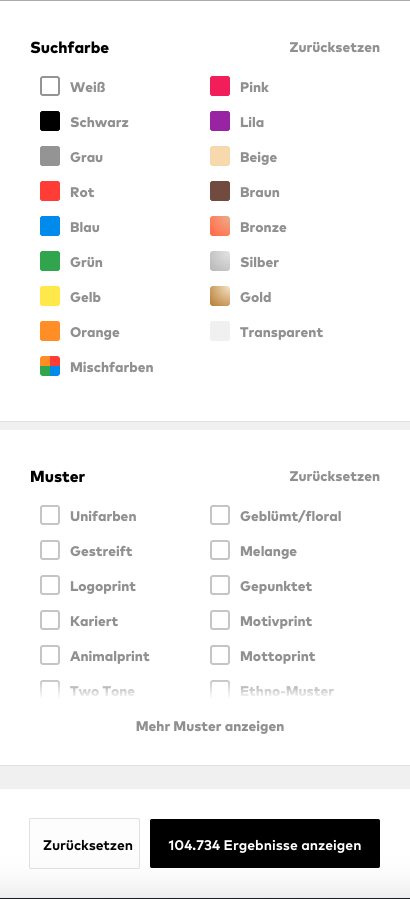

# About You Coding Challenge

The About You Coding Challenge is a test for candidate in the frontend area
which provides a ready to use implementation of a product stream that should be
extended.

The goal is to identify if the candidate fits into the company and is able to
write code in our frontend environment based on the applied position.

Also, it should give the candidate an insight of how ABOUT YOU is working and if
they fit into the company as well.

The test should be time boxed to a **maximum of 4 hours**, to not take too much
time from the candidate. The time management is done by the candidates on their
own.

After finishing the work, the About You team will have a look into the changes
and will discuss them with the candidate in the next interview in depth.

## Task

- please add a button on the right corner of the header
- on click, open a filter flyout on the right side of the browser frame
  - within the flyout, a color and pattern filter should be displayed
    - on click on a filter option, the products in the background should
      directly change based on the selected filter
    - multiple filter values should be combinable
  - at the end of the filter flyout, implement a submit button
    - on press of the submit button, the flyout should hide again

_It is possible to find a working implementation of a filter on our websites in
production via [aboutyou.de](https://www.aboutyou.de/maenner/bekleidung) or
[m.aboutyou.de](https://m.aboutyou.de/maenner/bekleidung). The URL to fetch
filters starts with `https://api-cloud.aboutyou.de/v1/filters`. Feel free to
reverse engineer our systems!_

## Rules

We always appreciate questions! In case something is unclear about the task,
please collect all your questions in one email and we will try to answer as good
as possible. Please keep in mind that we all have a limited amount of time per
day, so let’s please try to keep this process as efficient as possible.

If something is not working from a technical point of view, please reach out to
us **after reading the full documentation**.

This project has a predefined structure, technologies and coding styles. It is
allowed to question everything and we are open for all kind of changes or
refactorings.

It is also okay to use a different technology in case you don't feel comfortable
or fast enough with the provided setup, e.g. you can switch to sass instead of
styled components if you never worked with styled components before and have a
hard time to get into it.

Please find a list of supported asset that should work out of the box
[in the section Asset Types of the Parcel documentation](https://parceljs.org/getting_started.html).

It is okay to take shortcuts or add TODOs in the code. We recommend to document
those so that everyone is on the same page and understands what is going on.

## Getting Started

Install [NodeJS v12](https://nodejs.org/en/) or higher and
[yarn v1.17](https://yarnpkg.com/lang/en/).

Execute `yarn` in the root of this project to install the dependencies.

As soon as all dependencies are installed, execute `yarn start` to start the
project in development mode.

A dev server will start locally via `http://localhost:1234`. Please note that a
second task is spawned on `http://localhost:9459` as a proxy for the backend
api. In case the ports do not work in your environment, feel free to adjust them
in the `package.json`.

Tests can be executed via `yarn test`. `yarn fmt` will run the predefined
formatting rules on all files of the repository.

## Used Technologies

The project uses [Parcel](https://parceljs.org/) to bundle assets, which should
allow to use a wide variety of different asset types.

By default [TypeScript](https://www.typescriptlang.org/) in combination with
[React](https://reactjs.org/) and
[Styled Components](https://www.styled-components.com/) it used to bootstrap the
application.

Tests are executed using [Jest](https://jestjs.io/) and are written using
[React Testing Library](https://github.com/testing-library/react-testing-library)
and [yakbak (to record backend responses)](https://github.com/flickr/yakbak).

For code formatting [prettier](https://prettier.io/) as well as an
[editor config](https://editorconfig.org/) is in place.

## Have fun

Thank you already for taking your time to take this challenge! We hope that you
enjoy it.

We, from our side, are already excited about your unique solution to this
challenge and the discussion of your choices afterwards.
